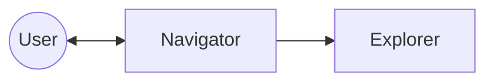
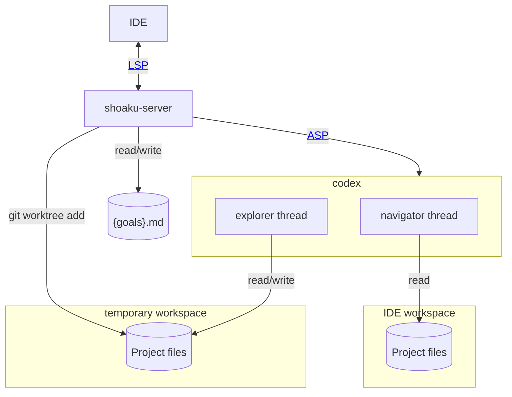

# Architecture

## Concept

The Navigator does not write code directly. Instead, it helps the user build understanding and make progress at their own pace, much like an experienced pair-programming partner.

Meanwhile, the Explorer works in the background toward a complete implementation. By indirectly observing the Explorer's progress, the Navigator can offer better context, guidance, and support.

## Detailed Structure

