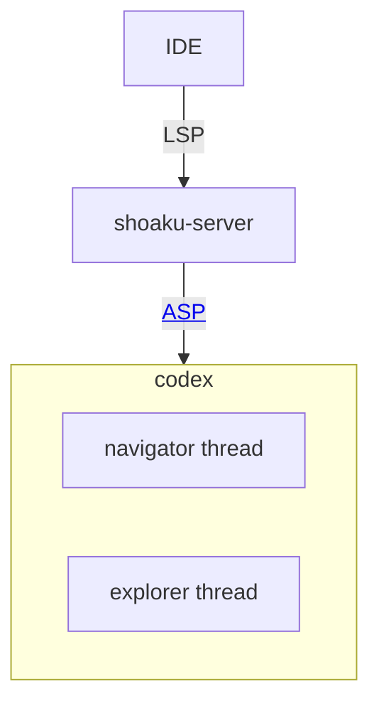

# Architecture

```mermaid
graph TD
  subgraph codex
    navigator[navigator thread]
    explorer[explorer thread]
  end

  IDE -- "LSP" --> shoaku-server -- "<a href='https://github.com/openai/codex/blob/main/codex-rs/app-server/README.md'>ASP</a>" --> codex
```
