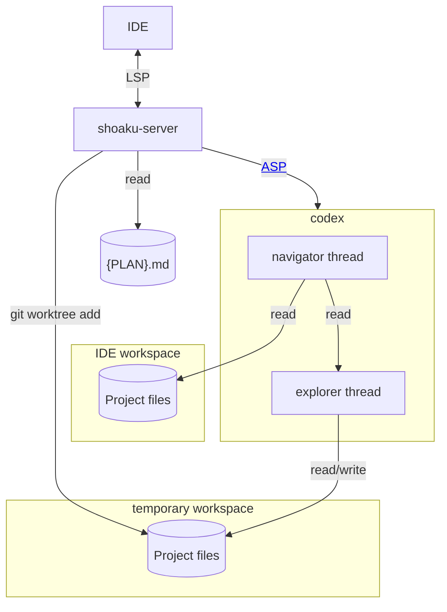

# Architecture

```mermaid
graph TD
  subgraph user_workspace["IDE workspace"]
    project-files[(Project files)]
  end
  subgraph sandbox_workspace["temporary workspace"]
    worktree-files[(Project files)]
  end
  subgraph codex
    navigator[navigator thread]
    explorer[explorer thread]
  end

  shoaku-server -- read --> todo[("{PLAN}.md")]
  IDE <-- LSP --> shoaku-server -- <a href='https://github.com/openai/codex/blob/main/codex-rs/app-server/README.md'>ASP</a> --> codex
  shoaku-server -- "git worktree add" --> worktree-files
  navigator -- read --> explorer
  navigator -- read --> project-files
  explorer -- read/write --> worktree-files
```
